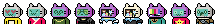
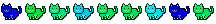
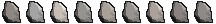
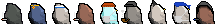

[Punks](#punks) ·
[Apes](#apes) ·
[Cats](#cats) ·
[Penguins](#penguins)  ·
[Dogs](#dogs)  ·
[Rocks](#rocks)  ·
[Tulips](#tulips)

# Awesome 24px (and 28px¹) Downloads - Free Pixel Art Collections in the 24x24 (and 28x28¹) Format

## Punks

All 10 000 Punks from the original LarvaLabs series.     Download  [**punks.png**](https://github.com/larvalabs/cryptopunks/blob/master/punks.png) (~800k) ++ Bonus: [**punks.csv**](https://github.com/cryptopunksnotdead/punks.attributes/tree/master/original/) attribute rarity & popularity dataset.

- Grayscale series.   Download  [**punks_grayscale.png**](https://github.com/cryptopunksnotdead/cryptopunks/blob/master/grayscale/i/punks_grayscale.png) (~800k).
- Sepia Vintage series.    Download   [**punks_sepia.png**](https://github.com/cryptopunksnotdead/cryptopunks/blob/master/grayscale/i/punks_sepia.png) (~800k).
- Phunks (Looking-Left) series.   Download    [**phunks.png**](https://github.com/cryptopunksnotdead/programming-cryptopunks/blob/master/i/phunks.png) (~800k).

<!-- break -->

All Star Collections / Selections

- 1458 Mohawk Nation series.    Download   [**mohawks.png**](https://github.com/cryptopunksnotdead/programming-cryptopunks/blob/master/i/mohawks.png) (~80k).
- 564 Blondies series.      Download   [**blondies.png**](https://github.com/cryptopunksnotdead/programming-cryptopunks/blob/master/i/blondies.png) (~30k).
- 88 Zombies series.      Download   [**zombies.png**](https://github.com/cryptopunksnotdead/programming-cryptopunks/blob/master/i/zombies.png) (~5k).
- 24 Ape series.      Download   [**apes.png**](https://github.com/cryptopunksnotdead/programming-cryptopunks/blob/master/i/apes.png) (~2k).
- 9 Alien series.    Download   [**aliens.png**](https://github.com/cryptopunksnotdead/programming-cryptopunks/blob/master/i/aliens.png) (~1k).

<!-- break -->

Punkverse

10 000 Gold(en) Punk series.    Download    [**goldenpunks.png**](collection/goldenpunks.png) (~750k)

10 000 Halloween Punk series.  Download    [**halloweenpunks.png**](collection/halloweenpunks.png) (~750k)

1000 Front-Facing Punk series.    Download    [**frontpunks.png**](https://github.com/cryptopunksnotdead/programming-cryptopunks/blob/master/i/frontpunks.png) (~80k) ++  Bonus: [**frontpunks.csv**](https://github.com/cryptopunksnotdead/punks.attributes/tree/master/front/) attribute rarity & popularity dataset.

1000 More Punks series. New attributes, new species.     Download  [**morepunks.png**](https://github.com/cryptopunksnotdead/programming-cryptopunks/blob/master/i/morepunks.png) (~200k) ++  Bonus: [**morepunks.csv**](https://github.com/cryptopunksnotdead/punks.attributes/tree/master/more/) attribute rarity & popularity dataset.

10 000 Expansion Punk series.     Download  [**expansionpunks.png**](https://expansionpunks.com/provenance/expansionpunks.png) (~800k) ++  Bonus:  [**expansionpunks.csv**](https://github.com/cryptopunksnotdead/punks.attributes/tree/master/expansion/) attribute rarity & popularity  dataset.

10 000 Avalanche Punks series.    Download  [**avalanchepunks.png**](collection/avalanchepunks.png) (~600k).

1000 International Punks series.   Download  [**intlpunks.png**](collection/intlpunks.png) (~200k).

1000 Ape Punks series.  Download  [**apepunks.png**](collection/apepunks.png) (~70k).

100 Alien Clan series.     Download  [**alienclan.png**](https://github.com/cryptopunksnotdead/programming-cryptopunks/blob/master/i/alienclan.png) (~10k)  ++    Bonus:  [**alienclan.csv**](https://github.com/cryptopunksnotdead/punks.attributes/tree/master/alienclan/) attribute rarity & popularity dataset.

40 All Star Cool Blue Aliens (Original+More+Expansion) series.  Download   [**aliens.png**](https://github.com/cryptopunksnotdead/cryptopunks/blob/master/aliens/i/aliens-randomized.png)  (~5k).
- 40 All Star Cyber Green Aliens series.     Download   [**aliens_green.png**](https://github.com/cryptopunksnotdead/cryptopunks/blob/master/aliens/i/aliens_green.png) (~5k).
- 40 All Start Burning Red Aliens series.    Download   [**aliens_red.png**](https://github.com/cryptopunksnotdead/cryptopunks/blob/master/aliens/i/aliens_red.png) (~5k).

## Apes

All 9 900 Bored Apes from the We Ape 24 series¹.  Download   [**boredapes.png**](collection/boredapes.png) (~4.2 MB).  ++ Bonus: [**boredapes.csv**](https://github.com/cryptopunksnotdead/punks.attributes/tree/master/boredapes/) attribute rarity & popularity dataset.

<!-- break -->

All Star Collections / Selections

- 433 Blue series.   Download   [**boredapes_blue.png**](collection/boredapes_blue.png) (~200k).
- 387 Red series.  Download   [**boredapes_red.png**](collection/boredapes_red.png) (~150k).
- 257 Neon Glow series.   Download   [**boredapes_neon_glow.png**](collection/boredapes_neon_glow.png) (~100k).
- 58 Stars and Stripes series.  Download   [**boredapes_stars_and_stripes.png**](collection/boredapes_stars_and_stripes.png) (~20k).
- 52 Acid series.  Download   [**boredapes_acid.png**](collection/boredapes_acid.png) (~20k).
- 35 Gold (Aurum) series.  Download   [**boredapes_au.png**](collection/boredapes_au.png) (~20k).

¹: Note - The bored apes from the weape24 series are in the original ~24x24~ 28x28 format.

## Cats

All 9 900 Cool Cats from 24px series.  Download   [**coolcats.png**](collection/coolcats.png) (~2.5 MB).  ++ Bonus: [**coolcats.csv**](https://github.com/cryptopunksnotdead/punks.attributes/tree/master/coolcats/) attribute rarity & popularity dataset.

<!-- break -->

All Star Collections / Selections

- 569 Mohawk series.  Download   [**coolcats_mohawks.png**](collection/coolcats_mohawks.png) (~130k).
- 283 Ninja series.   Download   [**coolcats_ninjas.png**](collection/coolcats_ninjas.png) (~60k).
- 221 TV Head series. Download   [**coolcats_tvheads.png**](collection/coolcats_tvheads.png) (~60k).
- 187 Pirate series.  Download   [**coolcats_pirates.png**](collection/coolcats_pirates.png) (~40k).
- 160 Unicorn series.  Download   [**coolcats_unicorns.png**](collection/coolcats_unicorns.png) (~40k).
- 51 Dragon series.  Download   [**coolcats_dragons.png**](collection/coolcats_dragons.png) (~8k).
- 51 Frog series.     Download   [**coolcats_frogs.png**](collection/coolcats_frogs.png) (~8k).

<!-- break -->

All 25 440 Moon Cats from the Moon Cat Rescue series (placed in a 24x24 canvas). Download   [**mooncatrescue.png**](https://github.com/cryptocopycats/awesome-mooncatrescue-bubble/blob/master/i/mooncatrescue.png) (~6 MB) ++
Bonus:  [**mooncatrescue.csv**](https://github.com/cryptocopycats/mooncatrescue)
attribute rarity & popularity dataset.

## Penguins

1000 Pudgy Penguins from the 24px series.  Download   [**pudgypenguins.png**](collection/pudgypenguins.png) (~270k).

## Dogs

25 Dodge (Shiba Inu) Punk series.  Download   [**dodge.png**](https://github.com/cryptopunksnotdead/programming-cryptopunks/blob/master/i/dodge.png) (~2k).

## Rocks

All 100 Stones from the 24px rocks series. Download    [**rocks.png**](collection/rocks.png) (~20k).

All 10 Stones from the 24px punk rocks series. Download   [**punkrocks.png**](https://github.com/cryptopunksnotdead/programming-cryptopunks/blob/master/i/punkrocks.png) (~2k).

## Tulips

101 Tulips series. Download  [**tulips.png**](collection/tulips.png) (~10k).

